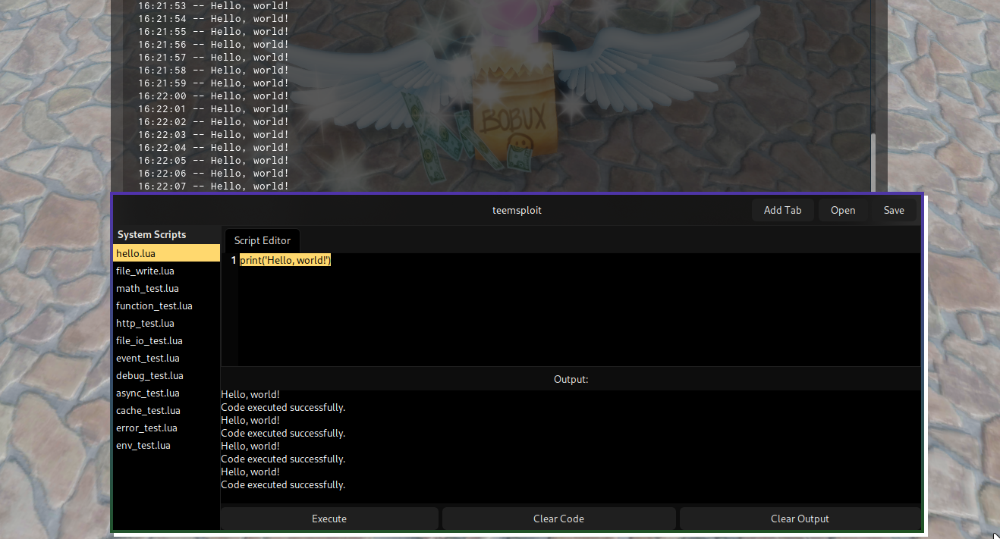

# Teemsploit Executor

A third-party external script executor for Roblox designed specifically for the unofficial **Sober** Roblox client on Linux.

---

**IMPORTANT NOTICE:**  
THIS SOFTWARE IS PROVIDED STRICTLY FOR EDUCATIONAL AND RESEARCH PURPOSES.  
THIS IS NOT CHEAT SOFTWARE, AND IS NOT INTENDED FOR USE IN VIOLATION OF ANY TERMS OF SERVICE, APPLICABLE LAWS, OR REGULATIONS.  

BY USING THIS SOFTWARE, YOU AGREE TO ASSUME ALL RISKS ASSOCIATED WITH ITS USE. THE AUTHOR DISCLAIMS ALL WARRANTIES, EXPRESS OR IMPLIED, INCLUDING BUT NOT LIMITED TO WARRANTIES OF MERCHANTABILITY AND FITNESS FOR A PARTICULAR PURPOSE.  
UNDER NO CIRCUMSTANCES SHALL THE AUTHOR BE LIABLE FOR ANY DIRECT, INDIRECT, INCIDENTAL, SPECIAL, OR CONSEQUENTIAL DAMAGES ARISING OUT OF OR IN CONNECTION WITH THE USE OR MISUSE OF THIS SOFTWARE.

---

## Disclaimer

This software is intended for lawful use only. Users are solely responsible for ensuring compliance with Roblox's terms of service and all relevant local laws. The author expressly disclaims any liability for damages or violations resulting from unauthorized or improper use of this software.

---

